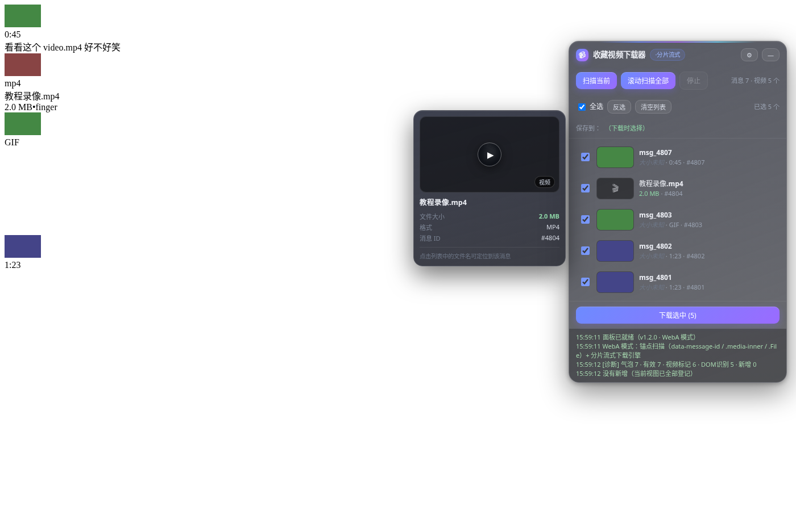
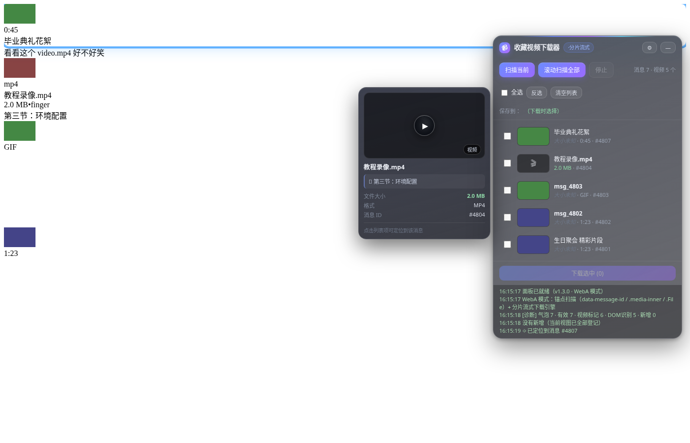

# Telegram 收藏视频批量下载器

> 油猴脚本（Tampermonkey / Violentmonkey）· 扫描 Telegram Web「收藏 / Saved Messages」中的全部视频，勾选后批量下载到本地。

## 功能特性

- **双版本兼容**：同时支持 WebK（`/k/`）与新版 WebA（`/a/`，CSS Modules 哈希化后）—— 新版 WebA 的容器类名会随构建变化，本脚本改用 `data-message-id`、`.media-inner`、`.File` 等**不受哈希影响的稳定锚点**扫描，永不受类名漂移影响。
- **批量勾选下载**：扫描列出全部视频，勾选后串行批量下载（每项间隔 1 秒，大文件可靠性的关键）。
- **双引擎**：
  - **官方管线**（WebK 专属）：调用 Telegram 自身的 `appDownloadManager.downloadToDisc`，大文件最稳，文件名由 Telegram 决定。
  - **分片流式**（WebK / WebA 通用）：Range 分片（512KB）流式下载 + OPFS（Origin Private File System）流式写盘，**内存占用只等于单个分片**，支持自定义命名、实时进度、断点续传友好。
- **文件大小全链路显示**：列表每项都显示大小；未知时从下载首个分片的 `Content-Range` 自动回补精确总大小（列表数字从「未知」跳变为真实大小）。
- **消息标题（caption）命名**：默认优先用消息标题作为文件名（`消息标题_消息ID.ext`），可一键切换为「原始文件名优先」。自动剥离时间戳等噪声。
- **悬停预览卡**：鼠标悬停列表项 0.3 秒，弹出毛玻璃预览卡（大缩略图 + 时长/GIF 徽标 + 完整文件名 + 大小 + 格式 + 消息 ID + 消息标题引用行）。
- **点击定位消息**：点击列表项整行即可定位到对应消息——视口内直接居中高亮，视口外按 mid 方向性自动滚动搜索（最多 20 秒）。
- **毛玻璃透明 UI**：`backdrop-filter` 高斯模糊、紫蓝青渐变光带、内嵌下载进度条、自定义滚动条，对 Telegram 样式零侵入（Shadow DOM 隔离）。
- **Blob 流式写盘**：真实 WebA 的视频地址是 `blob:` URL（GramJS 本地生成），已改为 `response.body` 流式边读边写，避免整包进内存。

## 安装

1. 浏览器安装 [Tampermonkey](https://www.tampermonkey.net/)（Chrome/Edge 推荐）或 Violentmonkey
2. 点击「添加新脚本」→ 全选删除模板 → 把 [`tg-saved-videos-downloader.user.js`](tg-saved-videos-downloader.user.js) 全部内容粘贴进去 → Ctrl+S 保存
3. 打开 [web.telegram.org](https://web.telegram.org/) 并登录（K 版 `/k/` 与 A 版 `/a/` 均支持）
4. 在左侧聊天列表打开「收藏 / Saved Messages」
5. 页面右上角出现悬浮面板

## 使用

1. 点击面板上的 **「扫描当前」**，扫描屏幕上已加载的消息
2. 向上滚动加载更多历史消息，新视频自动进列表（或点 **「滚动扫描全部」** 自动滚到顶部）
3. 勾选想要的视频（或「全选」）
4. 点 **「下载选中」** → 首次会让你选一个保存目录 → 之后串行下载、自动命名
5. 看日志里的 **`[诊断]` 行** 排查问题：只要 `气泡` 数大于 0 就说明锚点已命中

### 命名规则

默认「消息标题优先」（可在设置面板切换为「原始文件名优先」）：

| 视频类型 | 命名结果 |
|---|---|
| 媒体型 + 标题「生日聚会」 | `生日聚会_4801.mp4` |
| 文件型 + 标题「第三节：环境配置」 | `第三节：环境配置_4804.mp4` |
| 媒体型 + 无标题但有文件名 | `party_2025_4802.mov` |
| 无标题无文件名 | `msg_消息ID_时间戳.mp4` |

## 浏览器要求

- **Chrome / Edge 93+**（分片引擎依赖 File System Access API 与 OPFS 流式写盘）
- Firefox 不支持 File System Access，仅能使用「官方管线」引擎（WebK 专属）

## 技术要点

- **新版 WebA 稳定锚点表**（经 Ajaxy/telegram-tt 源码逐一核实）：
  - 消息元素：`[data-message-id]`
  - 媒体型视频：`.media-inner` 内含 `.icon-large-play` / `video` / `.message-media-duration` / `.media-loading`
  - GIF 识别：`.message-media-duration` 文本 = `"GIF"`
  - 文件型视频：`.File` + `.file-title`（title 属性带完整文件名）+ `.file-subtitle`
  - 消息标题：`.text-content`（Message.tsx 全局类，caption 与文本消息共用）
  - peerId：URL hash `?p=` 参数
- **viewer 视频检测三层策略**：精确选择器（WebK）→ 点击前后 diff 新增 `<video>` → 已有 video 新获得 src（对哈希化的 WebA viewer 通用）
- **Teact 框架无 DOM→组件反查**：新版 WebA 自研的 Teact 重实现 React 范式，无 `__reactFiber$` / `__teactInstance`，故放弃 fiber 路线改用锚点方案
- **Shadow DOM 隔离**：面板挂载在 Shadow DOM 内，Telegram 的 CSS 不会污染面板样式，反之亦然

## 集成测试

46 项断言全绿（模拟新版 WebA 真实 DOM：哈希类名容器 + `data-message-id` + `.media-inner`/`.File` 锚点 + diff 检测 viewer + Range 分片 + OPFS 字节校验 + blob 流式 + caption 提取 + 时间戳剥离 + 命名优先级 + 定位高亮）。

## 截图

| 毛玻璃面板 + 悬停预览卡 | caption 命名 + 点击定位高亮 |
|---|---|
|  |  |

## 许可证

MIT
